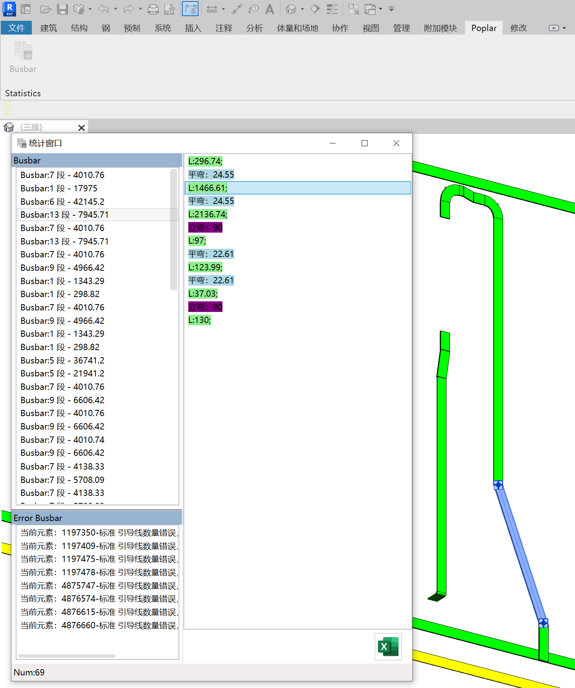

# Poplar

A revit addin to distinguish and statistics busbar in your *.rvt file.

Support Element Type:
```csharp
    BuiltInCategory.OST_DuctCurves
    BuiltInCategory.OST_DuctFitting
```

You can also select some elements to distinguish.

# Addin



# Version

Support Revit2019 - Revit2023

# Todo

1. Export Machining Information to Excel;
2. Make a intaller and muti-language;
3. More...
